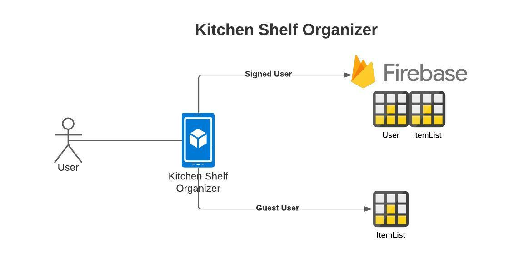
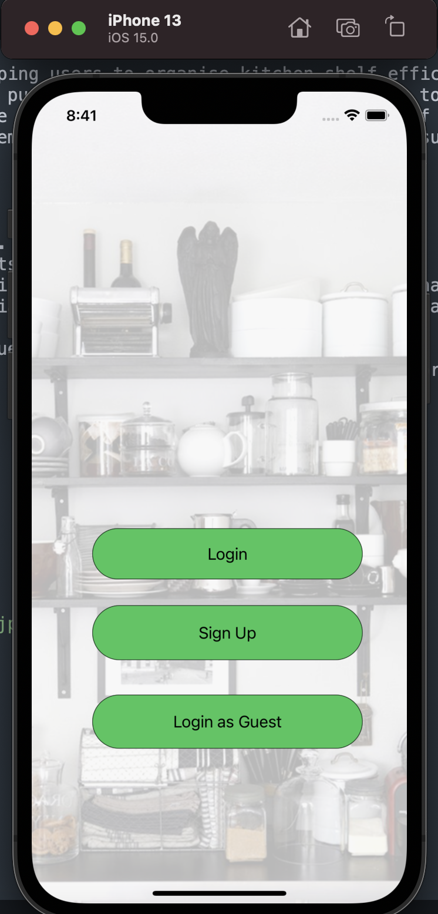
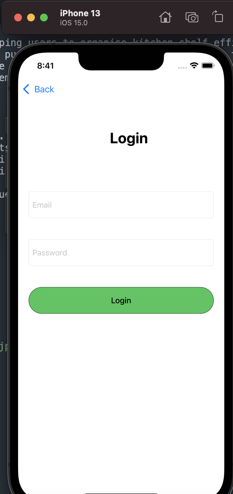
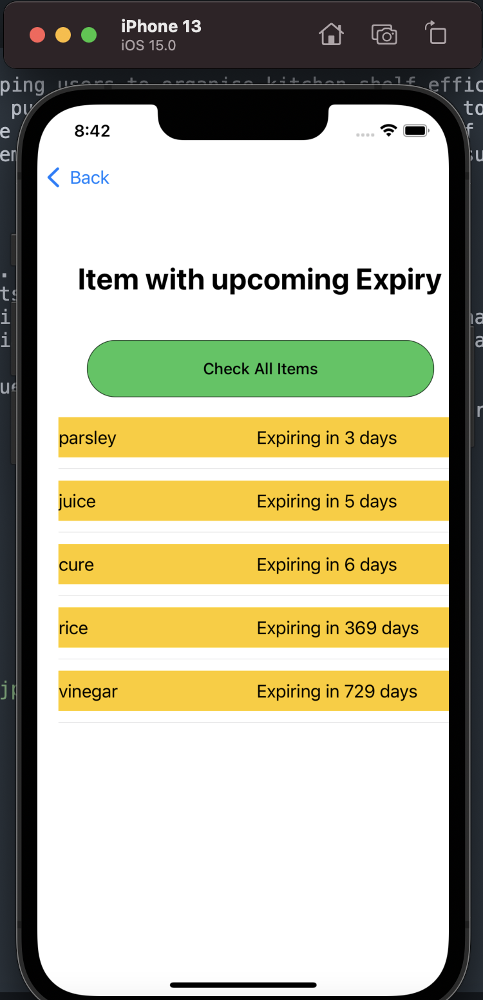
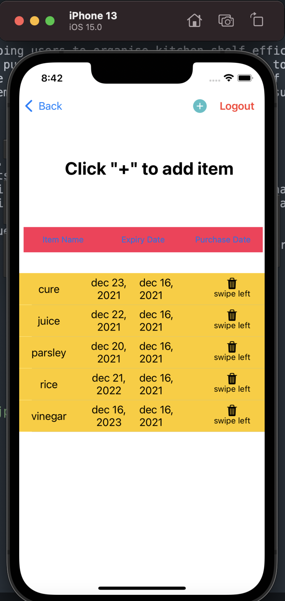
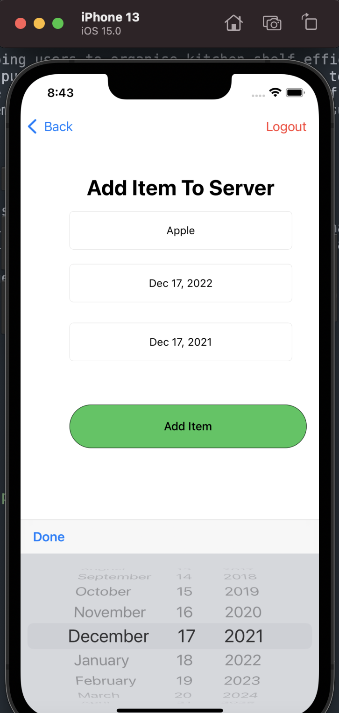

 # KitchenShelfOrganizer
 KitchenShelfOrganizer is an IOS app helping users to organise kitchen shelf efficiently at the home. It helps user to store item details like item name, expiry date and purchase date of item. It allows users to sort the items on multiple criteria ("item name", "expiry date" and "purchase data") hence helping user managing the Kitchen shelf efficiently. KitchenShelfOrganizer lists all the items with upcoming expiry dates.Proper management and proactive notification will result in efficient Kitchen management and reducing waste.

## Requirements/ UseCase
* App should have logo.
* App provides  Signup and Login feature.
* App provides feature for login as guests
* User can store data related to items like "item name", "expiry date" and "purchase data" on server(Firebase) or locally(RealmDB)
* User can sort data on different criteria like "itemName","expiryDate" or "purchaseDate"
* User can delete the item data from the "items list"
* Item list for each user should be unique.
* App should show the list of items with upcoming expiry date so that it can be prevented.

## Technologies

* Swift
* Firestore for server database
* Realm for local database

## High Level Design

## Demo

To check full Demo [click here](https://drive.google.com/file/d/1ztRM190XP8NyaVcoeoNP0T3xub1kD2wg/view?usp=sharing)

## Screenshots

  
&nbsp; &nbsp; &nbsp; &nbsp; 
  
&nbsp; &nbsp; &nbsp; &nbsp; 
  
&nbsp; &nbsp; &nbsp; &nbsp; 
  
&nbsp; &nbsp; &nbsp; &nbsp; 
  
  &nbsp; &nbsp; &nbsp; &nbsp; 

## Links for other projects
Check this github repo for all projects [click here](https://github.com/dj0894/INFO6350_SmartPhoneBasedDevelopement)

